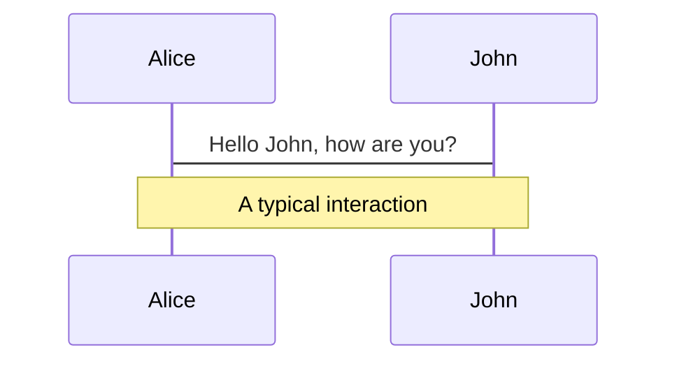
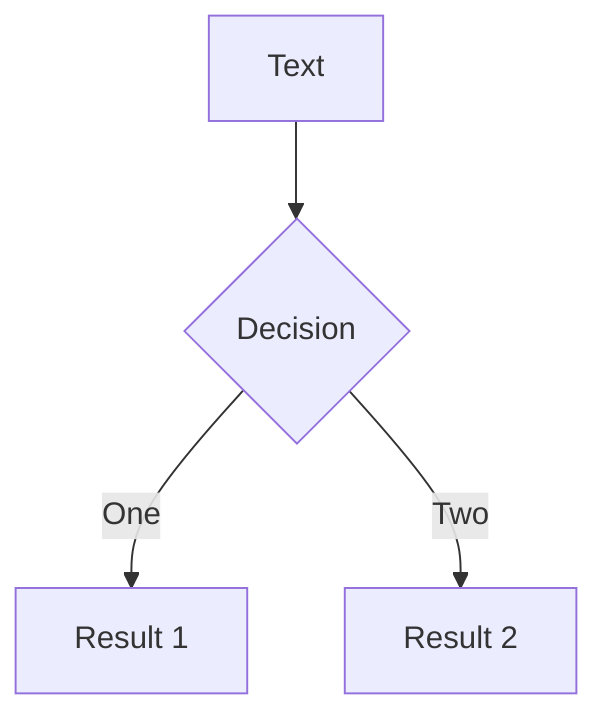
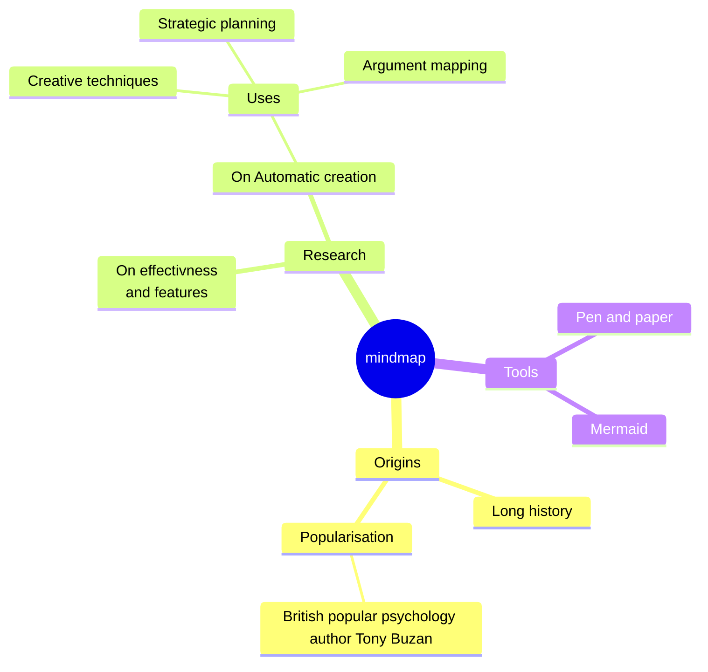
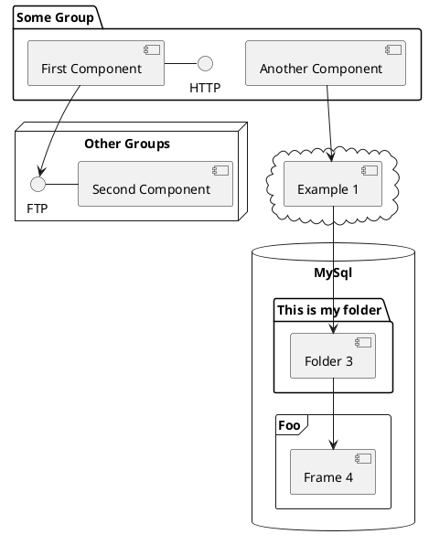

# AST抽象语法树

<div class="pt-12">
  <span @click="$slidev.nav.next" class="px-2 py-1 rounded cursor-pointer" hover="bg-white bg-opacity-10">
   next page <carbon:arrow-right class="inline"/>
  </span>
</div>
---
transition: fade-out
---

# 目录

- 📝 **1、什么是AST？** - 语法分析、词法分析
- 🎨 **2、如何实现代码压缩** 
- 🧑‍💻 **3、如何实现Eslint插件** 
- 🤹 **4、如何实现按需加载？** - babel-plugin-component如何实现的按需加载
- 🎥 **5、如何圈代码复杂度** - 针对目前公司现有代码质量，如何利用AST圈复杂度

写相关链接 [Why Slidev?](https://sli.dev/guide/why)

<style>
h1 {
  background-color: #2B90B6;
  background-image: linear-gradient(45deg, #4EC5D4 10%, #146b8c 20%);
  background-size: 100%;
  -webkit-background-clip: text;
  -moz-background-clip: text;
  -webkit-text-fill-color: transparent;
  -moz-text-fill-color: transparent;
}
</style>

---
transition: fade-out
---

# 1、AST、语法分析、词法分析

## AST 是什么 <br/>

<h6>
抽象语法树 (Abstract Syntax Tree)，简称 AST，它是源代码语法结构的一种抽象表示。它以树状的形式表现编程语言的语法结构，树上的每个节点都表示源代码中的一种结构。
</h6>

## AST的用途

<h6>
编辑器的错误提示、代码格式化、代码高亮、代码自动补全； <br/>
eslint、prettier 对代码错误或风格的检查； <br/>
webpack 通过 babel 转译 javascript 语法； <br/>
</h6>

## AST如何生成
js 执行的第一步是读取 js 文件中的字符流，然后通过词法分析生成 token，之后再通过语法分析( Parser )生成 AST，最后生成机器码执行。
整个解析过程主要分为以下两个步骤：

- **分词**：将整个代码字符串分割成最小语法单元数组
- **语法分析**：在分词基础上建立分析语法单元之间的关系

JS Parser 是 js 语法解析器，它可以将 js 源码转成 AST，常见的 Parser 有 esprima、traceur、acorn、shift 等。


<style>
  h6{
    opacity: 0.8 !important;
    margin: 10px 0;
  }
</style>
---
transition: slide-up

level: 2
---

## 词法分析
<p style="opacity:1">
词法分析，也称之为扫描（scanner），简单来说就是调用 next() 方法，一个一个字母的来读取字符，然后与定义好的 JavaScript 关键字符做比较，生成对应的Token。Token 是一个不可分割的最小单元:
</p>

<p style="opacity:.5">例如 var 这三个字符，它只能作为一个整体，语义上不能再被分解，因此它是一个 Token。</p>

词法分析器里，每个关键字是一个 Token ，每个标识符是一个 Token，每个操作符是一个 Token，每个标点符号也都是一个 Token。除此之外，还会过滤掉源程序中的注释和空白字符（换行符、空格、制表符等）<br/>

最终，整个代码将被分割进一个tokens列表（或者说一维数组）。

## 语法分析
 语法分析会将词法分析出来的 Token 转化成有语法含义的抽象语法树结构。同时，验证语法，语法如果有错的话，抛出语法错误。  
 我们来看下 javaScript 代码片段转成 AST 之后是什么样的

- AST在线转化 [AST Explorer](https://astexplorer.net/)

---
layout: image-right
image: https://p1-jj.byteimg.com/tos-cn-i-t2oaga2asx/gold-user-assets/2019/12/31/16f579fb424f6c8c~tplv-t2oaga2asx-jj-mark:3024:0:0:0:q75.png
---

# AST Explorer

```js
function test(){
  let a = 1;
  console.log(a)
}
```
该截图是使用 Acorn 解析。使用 Acorn 的原因是在 parser 解析中，Acorn 是公认的最快的。并且我们使用的 Webpack 打包工具中 babel 用的也是 Acorn。  

属性是 AST 的一部分，这个结构包含了很多属性。  

- VariableDeclaration 变量声明
- VariableDeclarator 变量声明的描述
- Expression 表达式节点
- ...

---

## 实战 AST 的运用

<div grid="~ cols-2 gap-4">
<div>  

<font color="red">题目</font>
通过上面介绍的 console.log AST，下面我们就来完成一个在调用 console.log(xx) 时候给前面加一个函数名，这样用户在打印时候能改方便看到是哪个函数调用的。  

```html
// 源代码
function getData() {
  console.log("data")
}
// --------------------
// 转化后代码
function getData() {
  console.log("getData", "data");
}
```</div>
<div>

<font color="red">介绍</font>  


首先介绍下我们需要使用的工具 Babel  

- @babel/parser : 将 js 代码 ------->>>  AST 抽象语法树；  
- @babel/traverse 对 AST 节点进行递归遍历；
- @babel/types 对具体的 AST 节点进行进行修改；
- @babel/generator :  AST 抽象语法树 ------->>> 新的 js 代码；  

进入 [@babel/parser](https://babeljs.io/docs/babel-parser#credits) 官网开头就介绍了它是使用的 Acorn 来解析 js 代码成 AST 语法树（说明确实 Acorn 比较好）。

</div>
</div>

---
class: px-20
---

## 开始码起来

1、新建文件打开控制台安装需要的包
```js
cnpm i @babel/parser @babel/traverse @babel/types @babel/generator -D
```
2、创建 js 文件, 编写大致布局如下 使用 AST
```js
const generator = require("@babel/generator");
const parser = require("@babel/parser");
const traverse = require("@babel/traverse");
const types = require("@babel/types");
function compile(code) {
  // 1.parse 将代码解析为抽象语法树（AST）
  const ast = parser.parse(code);
  // 2,traverse 转换代码
  traverse.default(ast, {});
  // 3. generator 将 AST 转回成代码
  return generator.default(ast, {}, code);
}
const code = `
function getData() {
  console.log("data")
}
`;
const newCode = compile(code)

```

---
theme: default
---
使用 node 跑出结果，因为什么都没处理，输出的是原代码.  

**完善 compile 方法**
```js
function compile(code) {
  // 1.parse
  const ast = parser.parse(code);
  // 2,traverse
  const visitor = {
    CallExpression(path) {
      // 拿到 callee 数据
      const { callee } = path.node;
      // 判断是否是调用了 console.log 方法 ;1. 判断是否是成员表达式节点;2. 判断是否是 console 对象; 3. 判断对象的属性是否是 log
      const isConsoleLog =types.isMemberExpression(callee) && callee.object.name === "console" && callee.property.name === "log";
      if (isConsoleLog) {
        // 如果是 console.log 的调用 找到上一个父节点是函数
        const funcPath = path.findParent(p => { return p.isFunctionDeclaration() });
        // 取函数的名称
        const funcName = funcPath.node.id.name;
        // 将名称通过 types 来放到函数的参数前面去
        path.node.arguments.unshift(types.stringLiteral(funcName));
      }}};
  // traverse 转换代码
  traverse.default(ast, visitor);
  // 3. generator 将 AST 转回成代码
  return generator.default(ast, {}, code) }
```

---

## 总结
为了兼容低版本浏览器 我们也通常会使用 webpack 打包编译我们的代码将 ES6 语法降低版本，比如箭头函数变成普通函数。将 const、let 声明改成 var 等等，他都是通过 AST 来完成的，只不过实现的过程比较复杂，精致。不过也都是这三板斧：  

- js 语法解析成 AST；
- 修改 AST；
- AST 转成 js 语法；

[控制台打印行号](http://git.kg-inc.cn/fe-sy-lahuo/reinforce-log/-/blob/dev/src/index.ts)


---

# Diagrams

You can create diagrams / graphs from textual descriptions, directly in your Markdown.

<div class="grid grid-cols-4 gap-5 pt-4 -mb-6">









</div>

[Learn More](https://sli.dev/guide/syntax.html#diagrams)

---
src: ./pages/multiple-entries.md
hide: false
---

---
layout: center
class: text-center
---

# Learn More

[Documentations](https://sli.dev) · [GitHub](https://github.com/slidevjs/slidev) · [Showcases](https://sli.dev/showcases.html)
